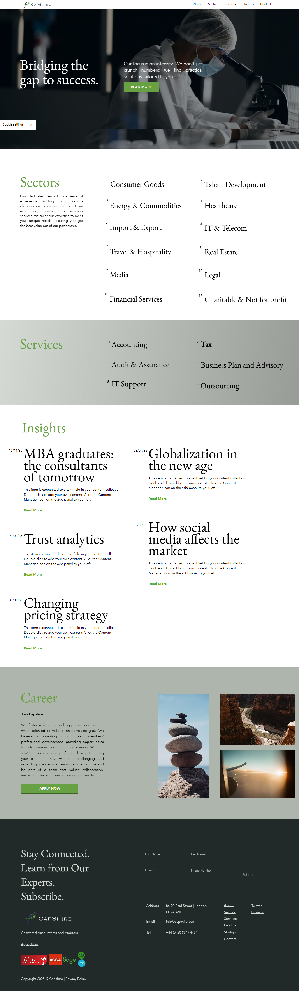

# Modern Wix Website Project ✨

**Created by: Ammara | Web Designer & Automation Expert**  
*Helping Brands Grow with AI-Powered Websites*

---

## 📌 Project Overview

This is a modern Wix website project created as part of my portfolio to demonstrate clean UI, mobile responsiveness, and user-centric navigation. It reflects my design process, structure planning, and implementation skills on the Wix platform.

---

## 💼 My Role & Contributions

- Designed and structured the entire website using **Wix Editor**
- Developed key sections: Hero, Services, About, and Contact
- Applied consistent branding and layout hierarchy
- Focused on responsiveness and smooth user flow
- Integrated form functionality and visual storytelling

---

## 🔧 Tools Used

- Wix Editor
- Custom Layout Blocks
- Responsive Design
- Wix Forms

---

## 🖼️ Website Preview

### Homepage

